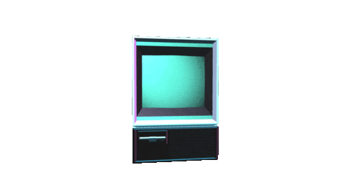
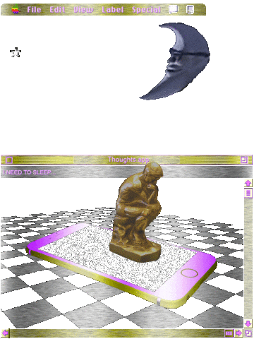

<!-- column_layout: [4, 5] -->

<!-- column: 0 -->

<!-- new_lines: 1 -->


<!-- column: 1 -->

<!-- pause -->

<!-- new_lines: 1 -->

### **Orhun Parmaksız**

🦀 Open source, Rust and terminals!

🐭 **Ratatui**, **Ratzilla**, **git-cliff**, **binsider**

📦 **Arch Linux** (btw)

---

`https://orhun.dev             `

`https://github.com/orhun      `

`https://youtube.com/@orhundev `

<!-- end_slide -->

<!-- column_layout: [2, 2, 4, 2] -->

<!-- column: 1 -->

<!-- jump_to_middle -->

**THE TERMINAL █**

<!-- column: 2 -->

<!-- new_lines: 6 -->



<!-- end_slide -->


<!-- pause -->

```sh +exec
rio
```

<!-- end_slide -->

### It's 2025, why still terminal?

<!-- pause -->

---

<!-- column_layout: [3, 2] -->

<!-- column: 1 -->

<!-- new_lines: 2-->


<!-- column: 0 -->

#### Timelessness

- Works the same across decades

<!-- pause -->

#### Powerful

- Your workflow, your rules
- Scripting & automation
- Endless possibilities

<!-- pause -->

#### Efficient

- Low power usage
- Runs on a potato

<!-- pause -->

<!-- reset_layout -->

<!-- column_layout: [1, 10] -->

<!-- column: 1 -->

> "Make the machine do exactly what you want with minimal friction"

<!-- end_slide -->

## Case: I want to download MP3 from YouTube

<!-- new_lines: 1 -->

<!-- column_layout: [1, 1] -->

<!-- column: 0 -->

<!-- pause -->


<!-- column: 1 -->

<!-- new_lines: 6 -->

<!-- pause -->

```bash
$ yt-dlp -f bestaudio
  --extract-audio
  --audio-format mp3
  --audio-quality 0
```

<!-- end_slide -->

## Case: I want to monitor my network traffic

<!-- new_lines: 1 -->

<!-- column_layout: [1, 1] -->

<!-- column: 0 -->

<!-- pause -->



<!-- column: 1 -->

<!-- new_lines: 6 -->

<!-- pause -->

```sh +exec +acquire_terminal
sudo oryx
```

<!-- end_slide -->

<!-- jump_to_middle -->

Terminal is the past, present and future. █

<!-- end_slide -->
