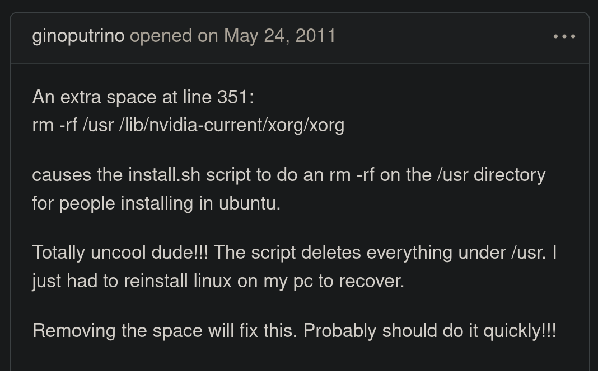

<!-- column_layout: [4, 5] -->

<!-- column: 0 -->

<!-- new_lines: 1 -->


<!-- column: 1 -->

<!-- pause -->

<!-- new_lines: 1 -->

### **Orhun Parmaksız**

🦀 Open source, Rust and terminals!

🐭 **Ratatui**, **Ratzilla**, **git-cliff**, **binsider**

📦 **Arch Linux** (btw)

---

`https://orhun.dev             `

`https://github.com/orhun      `

`https://youtube.com/@orhundev `

<!-- end_slide -->

<!-- new_lines: 3 -->

<!-- column_layout: [5, 4] -->

<!-- column: 1 -->


<!-- column: 0 -->

# Goals

1. Familiarize you with the terminal
2. Showcase the power of Rust in the terminal
3. Equip you with the modern libraries/tools
4. Inspire you to build stuff™ ✨

<!-- end_slide -->

<!-- column_layout: [2, 2, 4, 2] -->

<!-- column: 1 -->

<!-- jump_to_middle -->

**THE TERMINAL █**

<!-- column: 2 -->

<!-- new_lines: 6 -->


<!-- end_slide -->


<!-- pause -->

```sh +exec
rio
```

<!-- end_slide -->

### It's 2025, why still terminal?

<!-- pause -->

---

<!-- column_layout: [3, 2] -->

<!-- column: 1 -->

<!-- new_lines: 2-->


<!-- column: 0 -->

#### Timelessness

- Works the same across decades

<!-- pause -->

#### Powerful

- Your workflow, your rules
- Scripting & automation
- Endless possibilities

<!-- pause -->

#### Efficient

- Low power usage
- Runs on a potato

<!-- pause -->

<!-- reset_layout -->

<!-- column_layout: [1, 10] -->

<!-- column: 1 -->

> "Make the machine do exactly what you want with minimal friction"

<!-- end_slide -->

## "I want to download MP3 from YouTube"

<!-- new_lines: 1 -->

<!-- column_layout: [1, 1] -->

<!-- column: 0 -->

<!-- pause -->


<!-- column: 1 -->

<!-- new_lines: 6 -->

<!-- pause -->

```bash
$ yt-dlp -f bestaudio
  --extract-audio
  --audio-format mp3
  --audio-quality 0
```

<!-- end_slide -->

## "I want to monitor my network traffic"

<!-- new_lines: 1 -->

<!-- column_layout: [1, 1] -->

<!-- column: 0 -->

<!-- pause -->


<!-- column: 1 -->

<!-- new_lines: 6 -->

<!-- pause -->

```sh +exec +acquire_terminal
sudo oryx
```

<!-- end_slide -->

<!-- jump_to_middle -->

Terminal is the past, present and future. █

<!-- end_slide -->

<!-- column_layout: [2, 2, 4, 2] -->

<!-- column: 1 -->

<!-- jump_to_middle -->

**RUST IN THE TERMINAL █**

<!-- column: 2 -->

<!-- new_lines: 6 -->


<!-- end_slide -->

<!-- new_lines: 2 -->


<!-- jump_to_middle-->

<!-- new_lines: 5 -->

<!-- column_layout: [1, 2] -->

<!-- column: 1 -->

1. **Performance** ⚡
2. **Safety** 🛡️
3. **Ecosystem** 📦

<!-- end_slide -->

## Performance

<!-- pause -->

```
  rust-hyper ran
    1.01 ± 0.02 times faster than rust-reqwest
    1.24 ± 0.06 times faster than go-http-client
    2.03 ± 0.05 times faster than zig-http-client
    4.26 ± 0.12 times faster than curl
    8.57 ± 0.12 times faster than python-http-client
   19.93 ± 0.25 times faster than cpp-asio-httpclient
```

<!-- column_layout: [1, 3] -->

<!-- column: 1 -->

[](https://github.com/orhun/zig-http-benchmarks)

<!-- reset_layout -->


<!-- end_slide -->

## Safety

<!-- pause -->

<!-- column_layout: [4, 6] -->

<!-- column: 0-->


<!-- column: 1 -->

<!-- pause -->



> https://github.com/MrMEEE/bumblebee-Old-and-abbandoned/issues/123

<!-- end_slide -->

<!-- new_lines: 3 -->

```rust
use std::fs;

fn main() -> std::io::Result<()> {
    fs::remove_dir_all("/usr /lib/nvidia-current/xorg")?;
    Ok(())
}
```

<!-- pause -->

```
Error: Os { code: 2, kind: NotFound, message: "No such file or directory" }
```

<!-- end_slide -->


<!-- end_slide -->


<!-- end_slide -->

## Ecosystem

<!-- pause -->


rustc, rustup, clippy, rust-analyzer, rustlings, rustfmt, rust-bindgen, cargo

<!-- pause -->

cargo-about, cargo-audit, cargo-binstall, cargo-bloat, cargo-clone, cargo-crev, cargo-deb, cargo-deny, cargo-depgraph, cargo-dist, cargo-edit, cargo-expand, cargo-generate, cargo-generate-rpm, cargo-hack, cargo-insta, cargo-llvm-cov, cargo-machete, cargo-make, cargo-modules, cargo-msrv, cargo-nextest, cargo-outdated, cargo-public-api, cargo-semver-checks...

<!-- end_slide -->

## Libraries

`https://lib.rs/command-line-interface`

<!-- pause -->

### clap: _Command Line Argument Parser_

```rust
use clap::Parser;

/// Simple program to greet a person
#[derive(Parser, Debug)]
#[command(version, about, long_about = None)]
struct Args {
    /// Name of the person to greet
    #[arg(short, long)]
    name: String,

    /// Number of times to greet
    #[arg(short, long, default_value_t = 1)]
    count: u8,
}
```

<!-- end_slide -->

```sh +exec +acquire_terminal
unbuffer git cliff -h | less -R
```


<!-- end_slide -->

### colored: _Colorize your terminal output_

<!-- pause -->

```bash
echo -e "\033[34mthis is blue\033[0m"
```

<!-- pause -->

```rust
use colored::Colorize;

"this is blue".blue();

"this is red".red();

"this is red on blue".red().on_blue();

"you can also make bold comments".bold();

println!("{} {} {}", "or use".cyan(), "any".italic().yellow(), "string type".cyan());
```

<!-- end_slide -->

### duct: Library for running child processes

<!-- pause -->

```rust
use duct::cmd;
use std::io::prelude::*;
use std::io::BufReader;

// Merge standard error into standard output
// and read both incrementally
let out = cmd!("bash", "-c", "echo out && echo err 1>&2");

let reader = out.stderr_to_stdout().reader()?;
let mut lines = BufReader::new(reader).lines();

assert_eq!(lines.next().unwrap()?, "out");
assert_eq!(lines.next().unwrap()?, "err");
```

🔒 No risk of deadlocks and no risk of leaking zombie children processes 🧟

<!-- column_layout: [2, 1] -->

<!-- column: 1-->

<!-- pause -->

## And many more...

<!-- end_slide -->

<!-- new_lines: 1 -->

_<span style="color:#fff9ee">"R" in Rust stands for...</span>_


<!-- column_layout: [4, 1] -->

<!-- column: 1-->

<!-- pause -->

**<span style="color:#fff9ee">Ratatui!</span>** 🐁

<!-- end_slide -->

## Ratatui

<!-- column_layout: [3, 6] -->

<!-- column: 0 -->

<!-- new_lines: 1 -->


<!-- pause -->

<!-- column: 1 -->

<!-- new_lines: 2 -->

A Rust library that's all about cooking up terminal user interfaces (TUIs) 👨‍🍳🐀

`https://github.com/ratatui`
R

```bash +exec +acquire_terminal
cargo run --manifest-path ratatui/examples/apps/demo2/Cargo.toml
```

<!-- end_slide -->

<!-- column_layout: [1, 1] -->

<!-- column: 0 -->

## Widgets

- Block
- BarChart
- Calendar
- Canvas
- Chart
- Gauge
- LineGauge
- List
- Paragraph
- Scrollbar
- Sparkline
- Table
- Tabs
- ...

- Anything that implements `Widget` trait

<!-- column: 1 -->

<!-- pause -->

## Key Concepts

- Rendering
- Layout
- Event handling


<!-- end_slide -->

```rust {1-20|5|6|7,16-18|8-11|12-14|1-20} +line_numbers
use ratatui::crossterm::event::{self, Event};
use ratatui::{text::Text, Frame};

fn main() -> std::io::Result<()> {
    let mut terminal = ratatui::init();
    loop {
        terminal.draw(draw)?;
        if matches!(event::read()?, Event::Key(_)) {
            break;
        }
    }
    ratatui::restore();
    Ok(())
}

fn draw(frame: &mut Frame) {
    let text = Text::raw("Hello World!");
    frame.render_widget(text, frame.area());
}
```

<!-- end_slide -->

### Rendering

<!-- column_layout: [3, 1] -->

<!-- column: 0 -->

```rust {1-16|1|1,4,9|6,11|1-16} +line_numbers
let mut toggle = false;
loop {
    terminal.draw(|frame: &mut Frame| {
        if toggle {
            frame.render_widget(
                BarChart::default()
                //...
            );
        } else {
            frame.render_widget(
                LineGauge::default()
                //...
            );
        }
    });
}
```

<!-- column: 1 -->

<!-- new_lines: 10 -->


<!-- end_slide -->

### Layout

<!-- column_layout: [8, 2] -->

<!-- column: 1 -->

<!-- new_lines: 11 -->


<!-- column: 0 -->

```rust {1-9|2|3-7|9|1-9} +line_numbers
let layout = Layout::default()
    .direction(Direction::Horizontal)
    .constraints(&[
        Constraint::Length(10),
        Constraint::Percentage(70),
        Constraint::Min(5),
    ])
    .split(frame.area());
```

<!-- pause -->

```rust +line_numbers
let percent =
  if msg_count > 50 { 80 } else { 50 };

let contraints = &[
  Constraint::Percentage(percent),
  Constraint::Percentage(100 - percent)
];
```

<!-- end_slide -->

#### Constraints

```bash +exec +acquire_terminal
cd ratatui
cargo run -p constraints
cargo run -p constraint-explorer
```

<!-- pause -->

#### Flex

```bash +exec +acquire_terminal
cd ratatui
cargo run -p flex
```

<!-- end_slide -->

### Event Handling

- Backends: `crossterm`, `termion`, `termwiz`

<!-- pause -->

- Centralized event handling
- Centralized catching, message passing
- Distributed event loops/segmented applications

<!-- new_lines: 1 -->


<!-- end_slide -->

```rust {1-11|1-2|6|1-11} +line_numbers
let timeout = Duration::from_secs_f64(1.0 / 60.0);
if !event::poll(timeout)? {
    return Ok(());
}

if let Event::Key(key) = event::read()? {
    match key.code {
        KeyCode::Char('q') | KeyCode::Esc => break,
        _ => {}
    }
}
```


<!-- end_slide -->


<!-- end_slide -->

### TachyonFX 🌀

[](https://github.com/junkdog/tachyonfx)

```bash +exec +acquire_terminal
cd tachyonfx
cargo run --example basic-effects
cargo run --example tweens
```

<!-- end_slide -->

<!-- new_lines: 2 -->

```rust +line_numbers
fx::sequence(&[
    // "sweep in" the text from the left
    fx::ping_pong(fx::sweep_in(
        Motion::LeftToRight,
        10,
        0,
        Color::DarkGray,
        EffectTimer::from_ms(
          2000, Interpolation::QuadIn
       ),
    )),
    // coalesce the text back to its original state
    fx::coalesce((800, Interpolation::SineOut))
]);
```

<!-- end_slide -->

### tui-shader ✨

[](https://github.com/pemattern/tui-shader)

```bash +exec +acquire_terminal
cd tui-shader
cargo run --example stylize-other-widget
cargo run --example hello-shader
```

<!-- pause -->

```rust +line_numbers
let mut state =
  ShaderCanvasState::wgpu("shaders/voronoi.wgsl", "main");

frame.render_stateful_widget(
  ShaderCanvas::new(), frame.area(), &mut state
);
```

<!-- end_slide -->

### Ratzilla 🐭

[](https://github.com/orhun/ratzilla)


<!-- end_slide -->

```bash +exec
pkill trunk
cd ratzilla/examples/demo
trunk serve
```

<!-- end_slide -->

```rust {1-17|2-3|5-10|12-14|1-17} +line_numbers
fn main() -> std::io::Result<()> {
    let backend = DomBackend::new()?;
    let terminal = Terminal::new(backend)?;

    terminal.on_key_event(move |event| match event.code {
        KeyCode::Char(c) => {
            // Handle the key event
        }
        _ => {}
    });

    terminal.draw_web(move |frame| {
        // Draw the UI
    });

    Ok(())
}
```

<!-- end_slide -->

### bevy-ratatui-camera 📷

[](https://github.com/cxreiff/bevy_ratatui_camera)


```bash +exec +acquire_terminal
cd bevy_ratatui_camera
cargo run --example multiple
```

<!-- end_slide -->

## Future

7 tools

## Ratatui Apps

- "We need to be careful about the tools we create. They shape how we think."

## Presenterm

## Zellij

## Starship

## Atuin

## Nushell

## More

### The Future

ring crate

terminalcollective.org

Ecosystem gaps that need to be filled
Dream terminal tools that don’t exist yet
How to contribute and grow the Rust CLI/TUI ecosystem
Resources for getting started
Encouraging open-source contributions
Final thoughts

## Q & A

```

```
